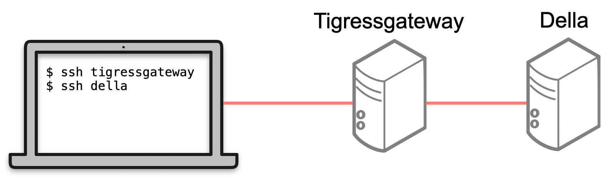
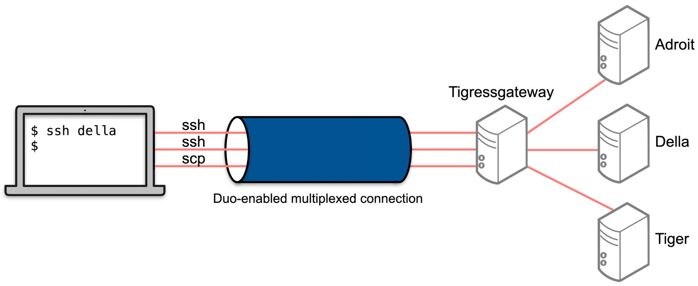

# Suppressing Duo

[Duo](https://princeton.service-now.com/service?id=kb_article&sys_id=575eff5387064dd012ae43bd0ebb35b0) enhances security with the downside of being disruptive (and even annoying). This page presents two approaches to suppressing Duo while still maintaining security. Note that by "suppressing" we mean minimizing as opposed to eliminating. That is, you will still need to Duo authenticate but much less so.

# I. VPN Approach

Here is the procedure:

1. Download, install, and configure the Global Protect [VPN client](https://www.princeton.edu/vpn).
2. Connect via the VPN client (**even if you are on-campus**).
3. SSH to a cluster. You will only need to Duo authenticate once per session.

To install a VPN client on your laptop/workstation follow this [OIT KnowledgeBase article](https://www.princeton.edu/vpn). GlobalProtect is recommended.

> Secure Remote Access (SRA) is a service for Princeton faculty, staff, and students who are off-campus and need to access restricted campus resources through a Virtual Private Network (VPN). After authenticating, remote computers function as if they were on campus, and as long as your SRA connection is active, all Internet activity from your computer is routed through Princeton servers and your computer is giving a Princeton IP address.

OIT is responsible for the VPN so please [contact them](https://princeton.service-now.com/service) with any questions or problems.

There are two disadvantages to using the VPN: (1) it requires launching Global Protect at the start of each session and (2) the VPN has limited network performance (see below). If you would prefer not to use a VPN then see the [multiplexing approach](#ii-multiplexing-approach-vpn-free-large-clusters-only) below.

### What if the VPN is too slow?

The use of a VPN will decrease your internet connection speed. The table below was generated at an off-campus location in Princeton with a FIOS connection using [speedtest.net](https://www.speedtest.net):

| VPN           | Download (Mbps)| Upload (Mbps)  |
| ------------- |:-------------:|:-----:|
| None          | 865           |   635 |
| None          | 888           |   598 |
| GlobalProtect | 593           |   213 |
| GlobalProtect | 688           |   220 |
| SonicWall     | 57            |    60 |
| SonicWall     | 57            |    62 |

The SonicWall VPN severely decreases transfer rates and should be avoided. If you still find poor performance with the GlobalProtect VPN then consider the multiplexing solution described below which is VPN-free.

[Another approach](https://researchcomputing.princeton.edu/ssh) which does not require a VPN is to ssh to `tigressgateway.princeton.edu` and then from there, ssh to your desired cluster (e.g., della) as shown in the figure below. **You must have an account on one of the large clusters to do this.** If you are transferring many files you will want to use multiplexing to avoid Duo authentication as described below.



On campus, you can measure the speed of your network connection at [https://tigerspeed.princeton.edu](https://tigerspeed.princeton.edu). If you are having trouble connecting to the Research Computing systems using SSH then [see this page](https://researchcomputing.princeton.edu/ssh) and in particular [https://myip.rc.princeton.edu/](https://myip.rc.princeton.edu/).

### Host nicknames or abbreviations

You can connect to a cluster like Della from your local machine (e.g., laptop) using the following command:

```
$ ssh <YourNetID>@della.princeton.edu
```

However, by modifying the `~/.ssh/config` file (or creating the file if necessary) on your local machine you can just do the following even if off-campus:

```
$ ssh della
```

Here is a sample `~/.ssh/config` file that allows one to do this (replace **aturing** with your NetID):

```
Host adroit.princeton.edu adroit
  User aturing
  HostName adroit.princeton.edu
  
Host della.princeton.edu della
  User aturing
  HostName della.princeton.edu
```

The first line in each stanza above specifies alternative names for the host. Put your Princeton NetID in the second line (i.e., replace `aturing`). The third line in each stanza should remain unchanged. You can add additional stanzas for other clusters or machines.

### Preventing VPN disconnects

If your VPN is disconnecting too frequently then try adding these lines to your `~/.ssh/config` file (make the file if necessary):

```
Host *
  Compression yes
  ServerAliveInterval 30
  ServerAliveCountMax 10
```

This will cause a "ping" every 30 seconds and hopefully prevent disconnections. OIT manages the VPN so please [contact them](https://princeton.service-now.com/service) for assistance. Consider using [tmux](https://researchcomputing.princeton.edu/support/knowledge-base/connect-ssh) to help deal with disconnects.

### If the Linux VPN is not working

Try the procedure below from Tim Jones of the Tech Clinic if your VPN client on Linux is not working:

```
echo "Enter your netid"
read netid
wget --user=$netid --ask-password https://web.princeton.edu/sites/oitdownloads/vpn/Linux%20x64/ConnectTunnel-Linux64.tar
tar -xvf ConnectTunnel-Linux64.tar
sudo ./install.sh
sudo apt-get install openjdk-8-jre
startctui
```

### PPPL VPN

The approach described above does not work with the PPPL Pulse Secure VPN. You will be required to Duo authenticate each time you use `ssh` or `scp`.

# II. Multiplexing Approach (VPN free, Large Clusters Only)

> Multiplexing involves the simultaneous transmission of several messages along a single channel of communication.

To use this approach, you must have an account on one of the large clusters: Della, Stellar or Tiger

The following solution is from Bill Wichser of Research Computing.

Q: *How do I avoid having to authenticate with Duo every time?*

A: Yes this is painful! But there are a few things one can do. I will explain one approach using ssh multiplexing which uses a single ssh connection and sends all communication over that channel. This means that you will only need to Duo authenticate once.

But do be aware of why Duo is being used in the first place. It is to protect our systems. The reason I mention this is because you do have options with the method I am going to provide with respect to time limits on how long the multiplexed functionality remains operational. Set too low and your very next ssh/scp will require Duo authentication again. But set too high, the protection could be bypassed which makes us all vulnerable.

Note that a [VPN](https://www.princeton.edu/vpn) is required from off-campus to use the OnDemand web portals of [MyAdroit](https://myadroit.princeton.edu/), [MyDella](https://mydella.princeton.edu/), [MyStellar](https://mystellar.princeton.edu/) and [MyTiger](https://mytiger.princeton.edu/) as well as for various library services such as downloading journal articles.

### On-Campus and Off-Campus (Recommended)

When off-campus and not using a VPN, one cannot `ssh` to the login node of a Research Computing cluster. **However, for users with an account on one of the large clusters** (not Adroit, not Nobel) one can use `tigressgateway` as a proxyjump server:



The procedure for doing this is shown below:

Step 1: On your **local machine** (laptop/desktop) run the command below to make two directories and set the permissions:

```
$ mkdir -p ~/.ssh/controlmasters && mkdir -p ~/.ssh/sockets && chmod 700 ~/.ssh/sockets
```

Step 2: Modify your `.ssh/config` file as follows (replace **aturing** with your NetID):

#### Mac, Linux and WSL

```
Host tigressgateway.princeton.edu tigressgateway
  HostName tigressgateway.princeton.edu
  User aturing
  ControlMaster auto
  ControlPersist yes
  ControlPath ~/.ssh/sockets/%p-%h-%r
  ServerAliveInterval 300

Host della.princeton.edu della
  User aturing
  HostName della.princeton.edu
  ProxyJump tigressgateway.princeton.edu
  ControlMaster auto
  ControlPersist yes
  ControlPath ~/.ssh/sockets/%p-%h-%r
```

#### Windows

```
Host tigressgateway.princeton.edu tigressgateway
  HostName tigressgateway.princeton.edu
  User aturing
  ControlMaster auto

Host della.princeton.edu della
  User aturing
  HostName della.princeton.edu
  ProxyJump tigressgateway.princeton.edu
```

If the file `~/.ssh/config` does not exist then make it.

You can then connect from your local machine (laptop/desktop) using the following command, for example:

```
$ ssh della
```

The command above will Duo authenticate but subsequent sessions will use that connection and not require Duo. The proxyjump server `tigressgateway` will be used. That is, the connection first goes to `tigressgateway` where it Duo authenticates before hopping to della.

If you need to forward local ports then add a `LocalForward` line after `ServerAliveInterval` for tigressgateway:

```
Host tigressgateway.princeton.edu tigressgateway
  ...
  ServerAliveInterval 300
  LocalForward 5901 della.princeton.edu:5901
```

This will enable port forwarding for the given ports in case you require VNC access or other processes to tunnel through (most users can ignore this). See the section for `ProxyJump` in `man ssh_config` for more. **You should choose new ports between 5900 and 9999** but most users will not need port forwarding so you may choose to omit lines beginning with `LocalForward`.

After completing the steps above, you should be able to `scp <localfile> della:` without additional Duo authentications since the connection is established and multiplexed.

#### Note for Windows Users

Do not include these lines:

```
  ControlMaster auto
  ControlPersist yes
  ControlPath ~/.ssh/sockets/%p-%h-%r
```

Below is a sample file of `.ssh/config` for multiple clusters (**replace aturing with your NetID**). You should only enter stanzas for the clusters and machines that you have acces to.

```
Host tigressgateway.princeton.edu tigressgateway
  HostName tigressgateway.princeton.edu
  User aturing
  ControlMaster auto
  ControlPersist yes
  ControlPath ~/.ssh/sockets/%p-%h-%r
  ServerAliveInterval 300

Host adroit.princeton.edu adroit
  User aturing
  HostName adroit.princeton.edu
  ProxyJump tigressgateway.princeton.edu
  ControlMaster auto
  ControlPersist yes
  ControlPath ~/.ssh/sockets/%p-%h-%r

Host adroit-vis.princeton.edu adroit-vis
  User aturing
  HostName adroit-vis.princeton.edu
  ProxyJump tigressgateway.princeton.edu
  ControlMaster auto
  ControlPersist yes
  ControlPath ~/.ssh/sockets/%p-%h-%r

Host della.princeton.edu della
  User aturing
  HostName della.princeton.edu
  ProxyJump tigressgateway.princeton.edu
  ControlMaster auto
  ControlPersist yes
  ControlPath ~/.ssh/sockets/%p-%h-%r

Host della-gpu.princeton.edu della-gpu
  User aturing
  HostName della-gpu.princeton.edu
  ProxyJump tigressgateway.princeton.edu
  ControlMaster auto
  ControlPersist yes
  ControlPath ~/.ssh/sockets/%p-%h-%r

Host della-vis1 della-vis2
  User jdh4
  HostName %h.princeton.edu
  ProxyJump tigressgateway.princeton.edu
  ControlMaster auto
  ControlPersist yes
  ControlPath ~/.ssh/sockets/%p-%h-%r

Host nobel.princeton.edu nobel
  User aturing
  HostName nobel.princeton.edu

Host stellar-amd.princeton.edu stellar-amd
  User aturing
  HostName stellar-amd.princeton.edu
  ProxyJump tigressgateway.princeton.edu
  ControlMaster auto
  ControlPersist yes
  ControlPath ~/.ssh/sockets/%p-%h-%r

Host stellar-intel.princeton.edu stellar.princeton.edu stellar
  User aturing
  HostName stellar-intel.princeton.edu
  ProxyJump tigressgateway.princeton.edu
  ControlMaster auto
  ControlPersist yes
  ControlPath ~/.ssh/sockets/%p-%h-%r

Host stellar-vis1.princeton.edu stellar-vis1
  User aturing
  HostName stellar-vis1.princeton.edu
  ProxyJump tigressgateway.princeton.edu
  ControlMaster auto
  ControlPersist yes
  ControlPath ~/.ssh/sockets/%p-%h-%r

Host stellar-vis2.princeton.edu stellar-vis2
  User aturing
  HostName stellar-vis2.princeton.edu
  ProxyJump tigressgateway.princeton.edu
  ControlMaster auto
  ControlPersist yes
  ControlPath ~/.ssh/sockets/%p-%h-%r

Host tiger.princeton.edu tiger
  User aturing
  HostName tiger.princeton.edu
  ProxyJump tigressgateway.princeton.edu
  ControlMaster auto
  ControlPersist yes
  ControlPath ~/.ssh/sockets/%p-%h-%r

Host tiger-vis.princeton.edu tiger-vis
  User aturing
  HostName tiger-vis.princeton.edu
  ProxyJump tigressgateway.princeton.edu
  ControlMaster auto
  ControlPersist yes
  ControlPath ~/.ssh/sockets/%p-%h-%r
```

On your local machine, to check if the multiplexed connection is alive (remember everything is going through tigressgateway):

```
$ ssh -O check tigressgateway
```

To end the connection manually:

```
$ ssh -O stop tigressgateway
```

### On-Campus Only

Almost all users should follow the directions for [On-Campus and Off-Campus](#on-campus-and-off-campus-recommended) above but if for some reason you only want to enable multiplexing when you are on-campus then follow this procedure.

Step 1: To make this work, on your Linux or macOS **local machine** (laptop/desktop), edit the file `~/.ssh/config` by adding a machine stanza which looks like this (**replace aturing with your NetID**):

```
Host della.princeton.edu della
  User aturing
  HostName della.princeton.edu
  ControlPath ~/.ssh/controlmasters/%r@%h:%p
  ControlMaster auto
  ControlPersist 10m
```        

Step 2: Then do a `mkdir -p ~/.ssh/controlmasters` to create the directory for telling ssh how to use this multiplexed session.

The very first login to `della` (from on-campus since no VPN) would start the multiplexing option:

```
$ ssh della
```

The command above will Duo authenticate but subsequent sessions will use that connection and not require Duo. The multiplexer remains active for ControlPersist time, as defined in your `~/.ssh/config` file, once the last ssh session has terminated.

Some handy commands from your local machine (laptop/desktop):

```
$ ssh -O check della    # this checks whether a multiplexed session is already open
$ ssh -O stop della     # kills the multiplexed session
```

The line `Host della.princeton.edu della` allows one to create aliases which explains why we can use `della` or `della.princeton.edu` in the commands above.

### Troubleshooting

To ignore your `config` file:

```
$ ssh -F /dev/null <YourNetID>@della.princeton.edu
```

To use an alternate `config` file:

```
$ ssh -F /path/to/alternate/config <hostname>
```

In some cases it may be necessary to close active `ssh` sessions on your local machine. First, find the open sessions:

```
$ ps uwx | grep -E 'PID|ssh'
```

Then kill specific processes (see the PID column to get the process id):

```
$ kill -9 <process-id>
```

### X11 Forwarding with SSH Multiplexing

If you are using ssh multiplexing AND the first connection you made did
not use X11 forwarding then none that follow will do so either and
attempting to add -Y/-X is useless. In this case you have to close all
ssh connections to the machine (ALL is very important - it has to ask
you for password/username/duo again) and then reconnect making sure that
the first connection uses -Y/-X flag.

### X11 Forwarding

If you are on a Mac and you experience problems with X11 forwarding then try adding the following lines to the bottom of `~/.ssh/config`:

```
Host *
  ForwardAgent yes
  ForwardX11 yes
  XAuthLocation /opt/X11/bin/xauth
```

Make sure that you have an X server running (e.g., [XQuartz](https://www.xquartz.org)) when using this approach. There are [better approaches](https://researchcomputing.princeton.edu/support/knowledge-base/gui-applications) to working with graphics on the Research Computing clusters than X11.
